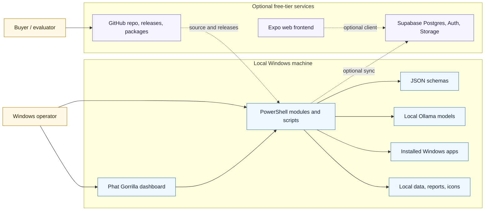
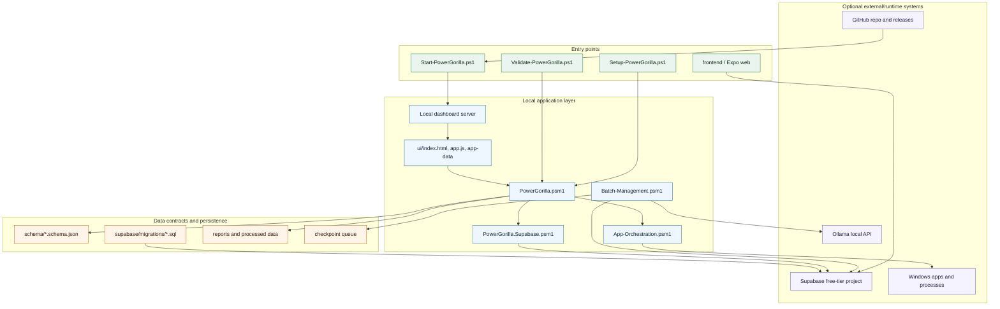
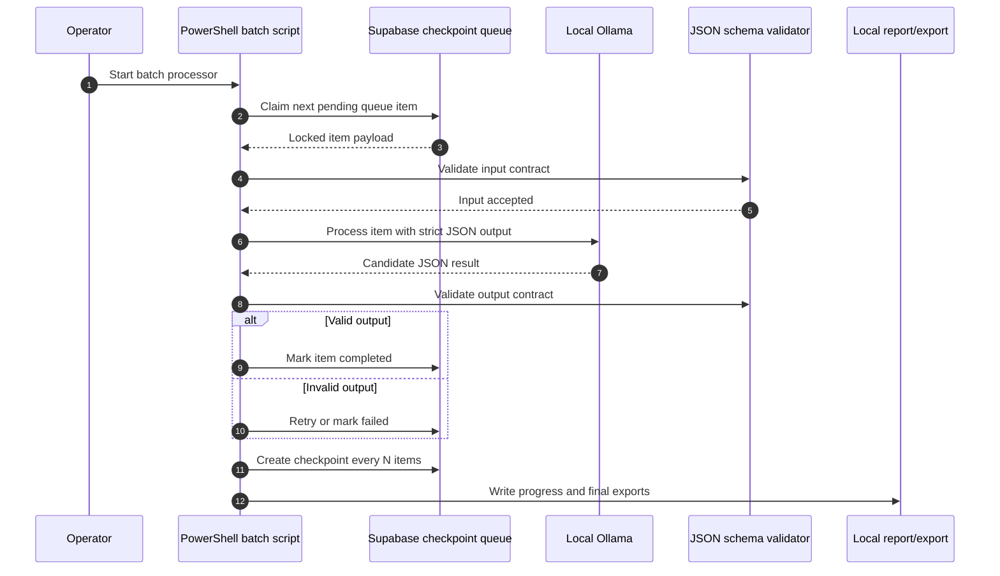
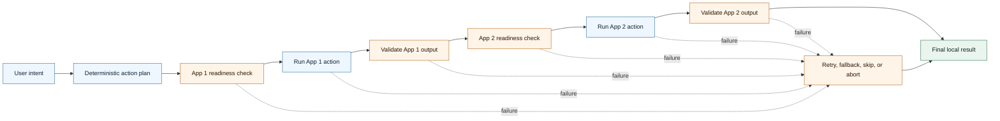
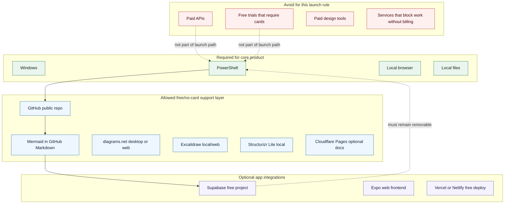
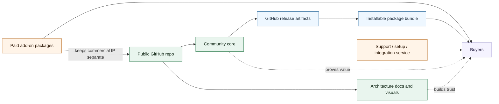

# Phat Gorrilla Architecture Visuals

This document uses GitHub-native Mermaid diagrams so the visuals render directly in Markdown on GitHub. No paid diagramming account, trial, credit card, or external SaaS is required.

## System Context

## Container Map

## Batch Processing Flow

## Multi-App Orchestration Flow

## Free-Tier Boundary

## Sellable Package Shape

## No-Card Visual Tool Stack

| Need | Primary tool | Why it fits |
|---|---|---|
| GitHub README architecture visuals | Mermaid code blocks | Renders in GitHub Markdown and stays version controlled |
| Polished export diagrams | diagrams.net | Free diagramming with local files and SVG/PNG export |
| Hand-drawn concept maps | Excalidraw | Free/open-source visual sketching |
| C4-style architecture modelling | Structurizr Lite | Free/open-source local authoring for system/context/container diagrams |
| Public docs site | GitHub Pages or Cloudflare Pages | Free hosting path for documentation and launch pages |

## Visual Rule

Use Mermaid for the source of truth. Export a polished PNG/SVG only when you need a marketplace image, a README banner, or a social preview. That keeps the real architecture editable in Git and avoids locking the project into any paid design service.
